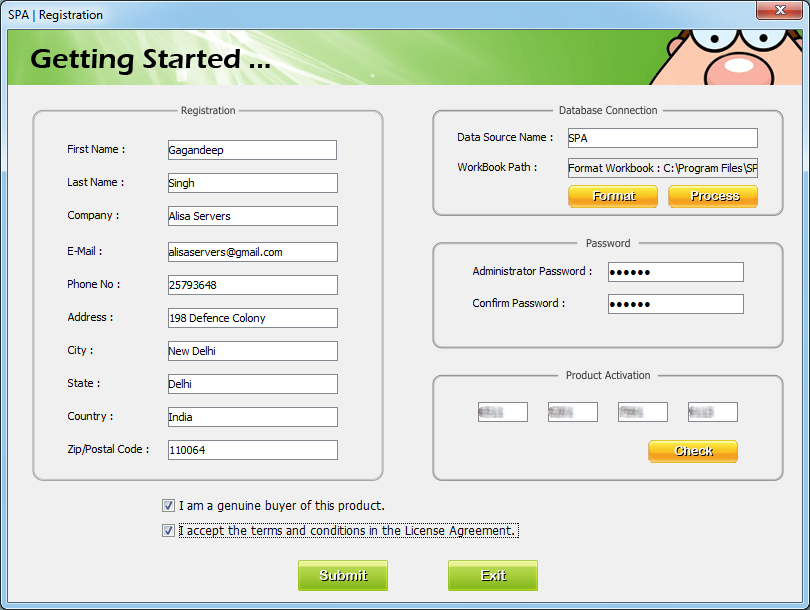
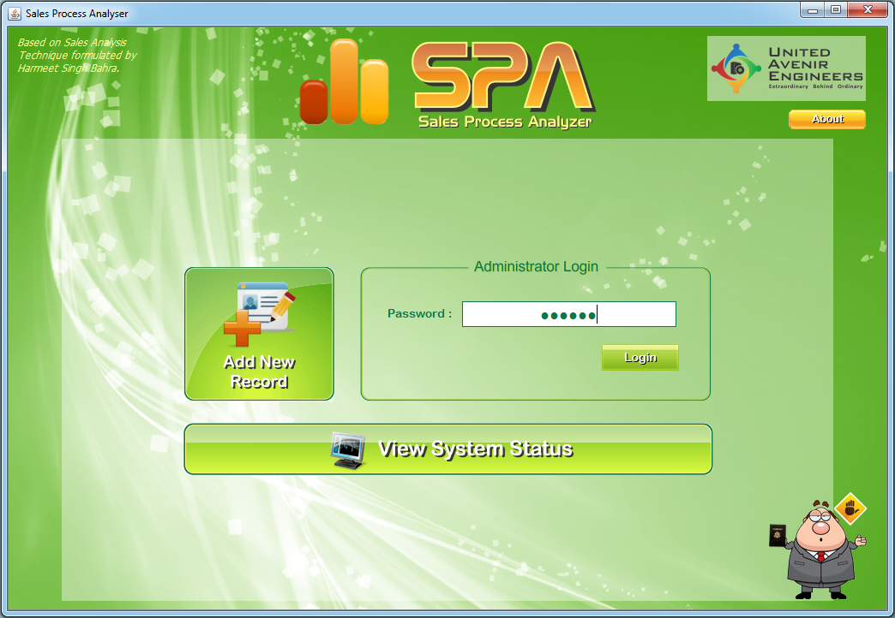
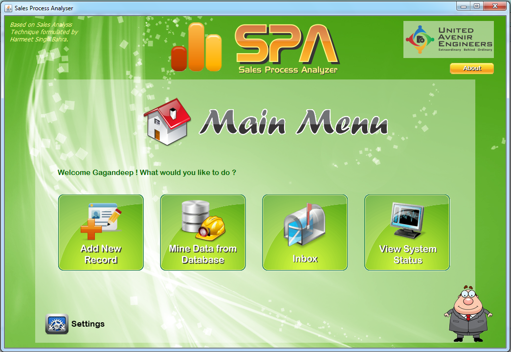
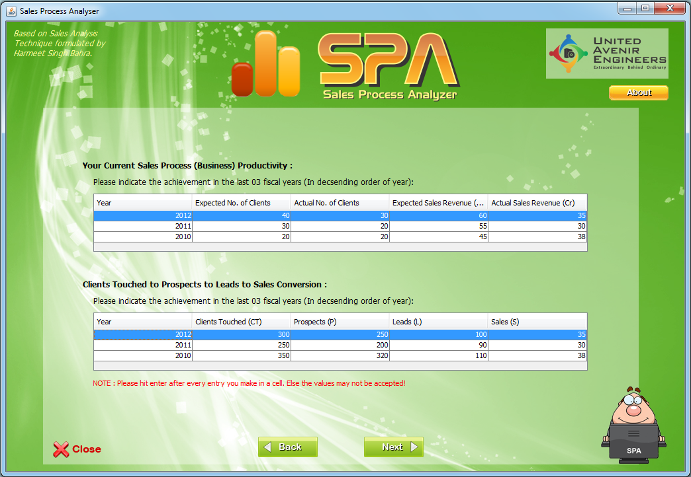
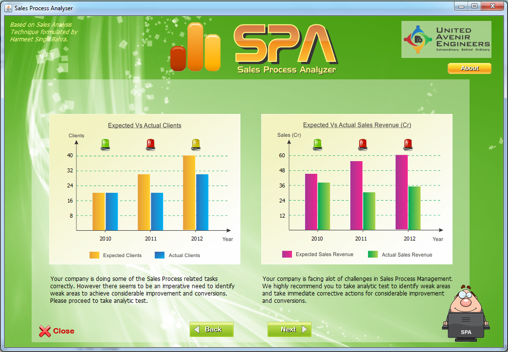
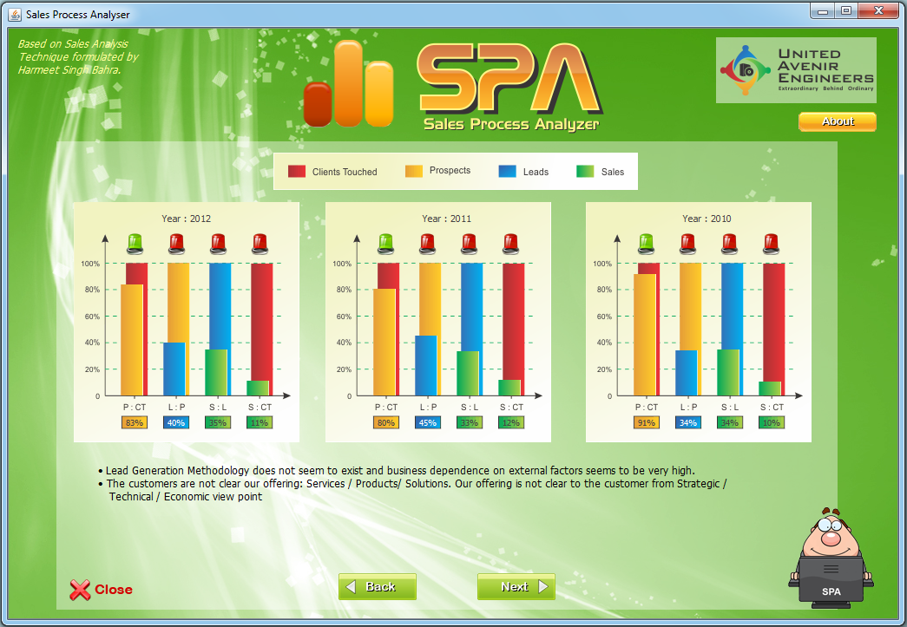
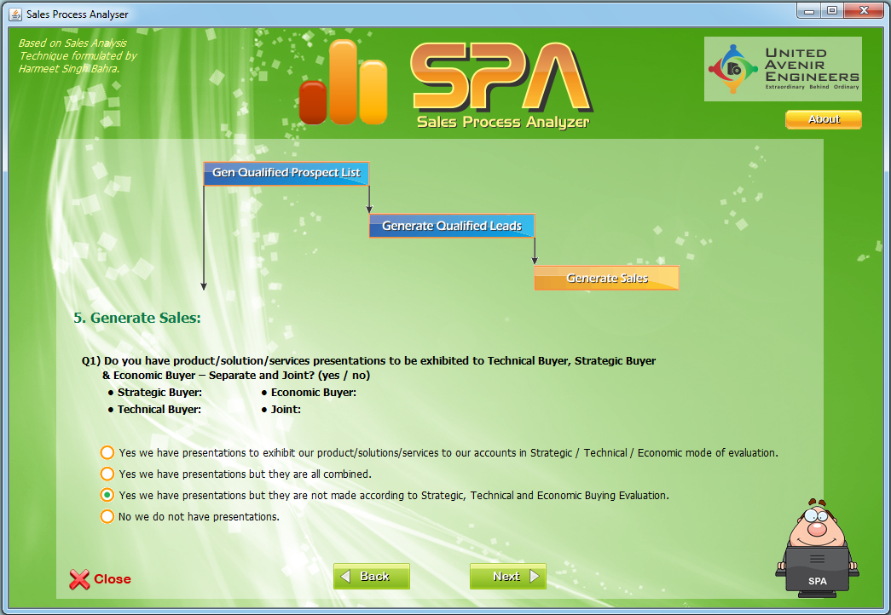
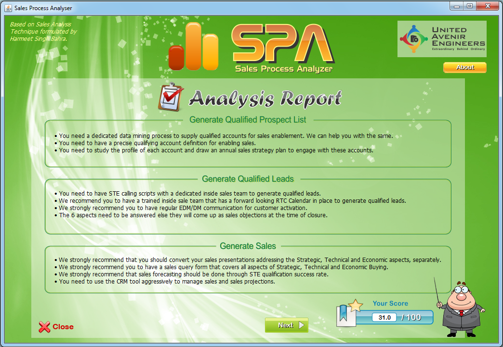
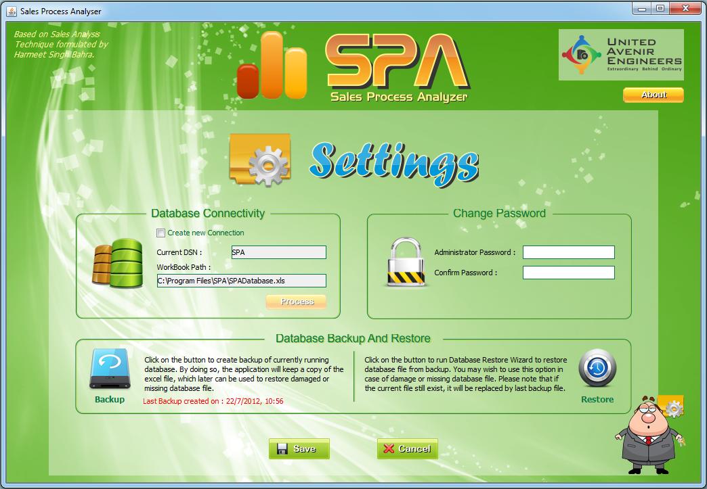

**(2012-2013: 3rd Year, Minor Project)**

# Sales Process Analyzer (2012-13)

Sales Process Analyzer is a sales management tool that enables you to identify weak areas in your sales process and have more qualified prospects, leads and more sales conversions. Sales Process Management is imperative for the SMB organizations as it is for the larger ones, to take the former’s business to the next level. Sales Process Management is a market proven business management technique that provides a great forecasting ability for forward looking business. The analyzer tool takes inputs based on number data & choice selection and based on logics & algorithms generates a report that identifies areas of concern for the party that takes test on the analyzing tool.

Since, companies will have monthly, quarterly and annual targets; Sales Process Analyzer tells the company whether its sales force is on track.
SPA also enables the company to plan and prioritize future sales strategies and predict their results. It may also be used to analyze past performance against targets, track the effectiveness of marketing campaigns, forecast future trends, develop sales strategies and calculate sales commissions.

#### Programming Language:

The project has been build in **Java (Java SE Develeopment Kit 6)** programming language using **NetBeans IDE 7.1**.

## Declaration

All work presented in the project entitled “Sales Process Analyzer” has been submitted in the partial fulfillment of the requirements for the award of the degree of Bachelor of Technology in Computer Science & Engineering, Guru Tegh Bahadur Institute of Technology, affiliated to Guru Gobind Singh Indraprastha University, New Delhi, India. This is an authentic record of our own work carried out under the guidance of our mentor Ms. Rekha Bhatia.

#### Team Members:
- Gagandeep Singh
- Amanpreet Singh Chauhan
- Hargeet Kaur

_**Note:** The title 'United Avenir Engineers' is not a registered company/organization/entity. It only signifies group of college students pursing engineering, exploring and learning engineering challenges. All trademark or copyright owing to 'United Avenir Engineers' are for demonstration purpose only. However, copyright of code and related work belongs to the team members._

## Thesis
Click [here](_Publish/Thesis_SalesAnalyzer_2012_13.pdf) to download thesis for the project.

Click [here](_Publish/PPT_SalesAnalyzer.pdf) to download Power-Point presentation.

## Basic Flow

1. The application takes set of inputs from the user that include personal information, company’s past performance and a questioner that consist of twelve multiple choice questions to understand sales process in the client’s organization. 
2. Next, the application applies an algorithm based on certain business dimensions and facts to process all inputs.
3. It then generates output in form of graphs and text specifying weak areas and suggestions to improve them.
4. The application also generates a PDF file containing all discussion.
5. The application is supported by a primary database that stores information of clients consulted which later can be used for future reference. The user can select data and load it into the application for analysis.

## Screenshots

|    |   |
|---|---|
|    |   |
|   |   |
|   |   |
|   |   |
|   |   |

Generated PDF Report Sample: [Download](_Publish/Report_Sample.pdf)

## How to run

- Download and extract [Disk_SalesAnalyzer.zip](_Publish/Disk_SalesAnalyzer.zip) from [_Publish/](_Publish) directory.
- Run 'Setup.exe' and follow the instructions to install.
- Run 'SPA.exe' to launch the application.

## References

- Herbert Schildt, “The Complete Reference Java – Seventh Edition”, Tata McGraw-Hill , 2011.
- Katy Sierra and Bert Bates, “Head first Java” , 2nd  Edition.
- “How to Connect to an Excel Spreadsheet using JDBC in Java”, http://www.javaprogrammingforums.com/jdbc-database-tutorials/356-how-connect-excel-spreadsheet-using-jdbc-java.html
- “How to make Dialogs”, http://docs.oracle.com/javase/tutorial/uiswing/components/dialog.html
- “How to round a number to n decimal places in java”, http://stackoverflow.com/questions/153724/how-to-round-a-number-to-n-decimal-places-in-java
- “How can I connect to an Excel spreadsheet file using jdbc”, http://www.jguru.com/faq/view.jsp?EID=32876
- “Sun MicroSystems - JAVA Training”, Sun Microsystems Inc.
- “Master IT – Advance Java Tutorial”, Cyclon.
- “Jframe at Center Screen”, http://www.java-forums.org/awt-swing/3491-jframe-center-screen.html.
- “Adding Image to Header and footer at generating Itext PDF”, http://www.roseindia.net/answers/viewqa/Java-Beginners/20666-Adding-Image-to-Header-and-footer-at-generating-Itext-PDF.html
- “Adding an Itext Image to a PDF document”, http://tutorials.jenkov.com/java-itext/image.html
- “Copying a File or Directory , http://docs.oracle.com/javase/tutorial/essential/io/copy.html
- “Generate PDF files from Java applications dynamically”, http://www.ibm.com/developerworks/opensource/library/os-javapdf/
- “PDF Generation in Java using iText JAR” , http://viralpatel.net/blogs/generate-pdf-file-in-java-using-itext-jar/
- “Getting Cell Values in a Jtable” , http://www.roseindia.net/java/example/java/swing/GetCellValues.shtml
- “How to round a number to n decimal places in Java - Stack Overflow” , http://stackoverflow.com/questions/153724/how-to-round-a-number-to-n-decimal-places-in-java
- “Adding an IText Image to a PDF document.” , http://tutorials.jenkov.com/java-itext/image.html
- “Insert Row in Java,Inserting Row in JTable,Code to Add Row in Java Table Using Swing” , http://www.roseindia.net/java/example/java/swing/InsertRows.shtml
- “iText Tutorials - iText images, Java PDF API for Open, Manipulate and Creation” , http://www.geek-tutorials.com/java/itext/itext_image.php
- “iText example at JavaRanch” , https://www.coderanch.com/how-to/java/ItextExample
- “pdf generation - java create pdf with header and footer - Stack Overflow” , http://stackoverflow.com/questions/5551456/java-create-pdf-with-header-and-footer
- “How to Use Modality in Dialogs” , http://docs.oracle.com/javase/tutorial/uiswing/misc/modality.html
- “PDF Generation in Java using iText JAR” , http://viralpatel.net/blogs/generate-pdf-file-in-java-using-itext-jar

